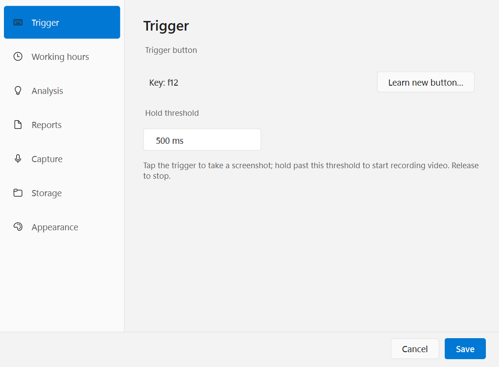
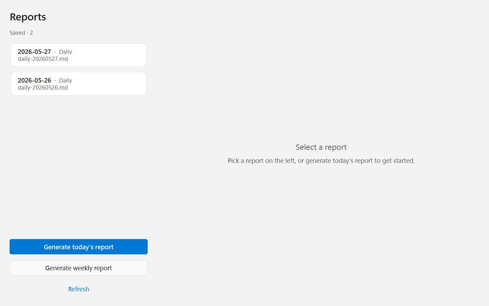
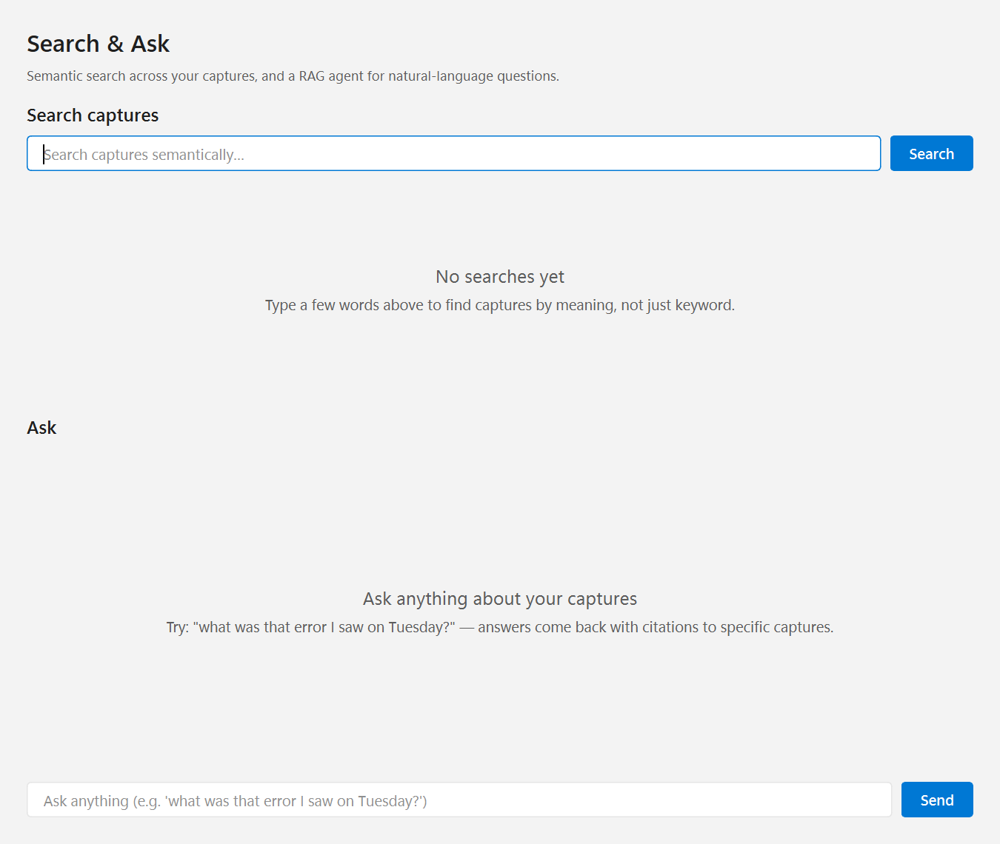
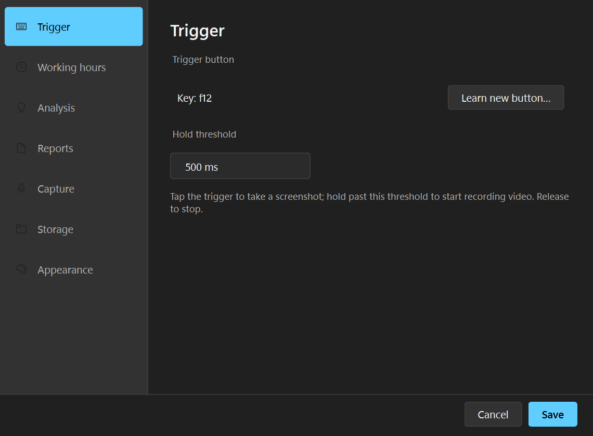
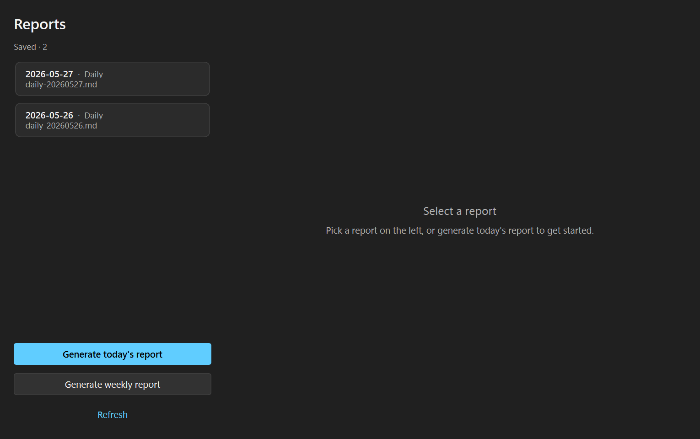
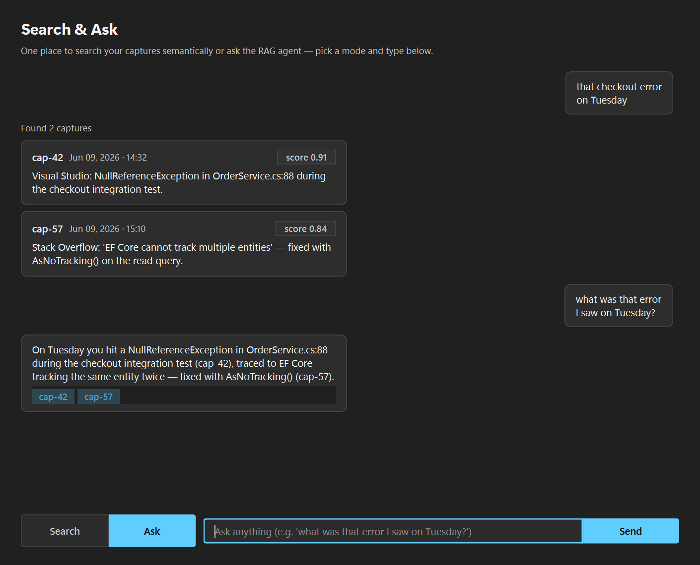

# RIN — Record It Now

> **Languages:** [English](README.md) · **中文** · **开发或贡献？** 见 [`docs/DEVELOPING.md`](docs/DEVELOPING.md)

[](docs/DEVELOPING.md#testing)
[](#要求)
[](LICENSE)
[](#要求)
[](https://github.com/dengyanbo/RecordItNow/actions/workflows/ci.yml)
[](https://github.com/dengyanbo/RecordItNow/releases)

一个 Windows 托盘应用：**按一个键截屏，然后让 LLM 把屏幕活动变成可搜索的内容**。

- **轻点**触发键 → 所有屏幕的全分辨率 PNG + 缩略图
- **长按** (> 500 ms) → MP4 + 音频录制，直到松手
- 空闲时间 / 非工作时间，RIN 自动 **OCR + Whisper + 视觉 LLM** 分析每次 capture，写入本地向量库
- **🔎 Search & Ask** 自然语言提问（比如 *"周二我看到的那个 error 是什么？"*），RAG agent 带 `cap-N` 引用回答
- 每日 / 每周生成 Markdown 报告，可导出 PDF / HTML / 写入 Obsidian vault
- **Skills** 插件按你的规则归类——默认识别 16 位 case ID 和 19 位 collab task ID，关闭后自动归档
- 100% 本地存储。云端 LLM 完全可选（默认 `copilot_cli` 不需要 API key）

---

## 安装

**一键安装** — 单个下载，不需要装 Python（~430 MB）：

1. 从 [GitHub Releases](https://github.com/dengyanbo/RecordItNow/releases) 下载 `RIN-vX.Y.Z-windows-installer.zip`
2. 右键 zip → **全部解压** （到任意目录）
3. 在解压出的目录里 **双击 `Install.bat`**

完事。安装器会：

- 把独立运行的 bundle 复制到 `%LOCALAPPDATA%\Programs\RIN\`
- 如果 `PATH` 里没 FFmpeg，自动用 winget 装一个
- 创建开始菜单快捷方式

**常用 flag** — 想用的话，在解压目录里开个 PowerShell 跑：

```powershell
.\install.ps1 -FromBundle .\bundle -Force -Autostart            # 同时设置开机自启
.\install.ps1 -FromBundle .\bundle -Force -InstallDir "D:\Apps\RIN"
.\install.ps1 -FromBundle .\bundle -Force -SkipDeps             # 跳过 FFmpeg 自动安装
```

想从源码构建或贡献代码？看 [`docs/DEVELOPING.md`](docs/DEVELOPING.md)。

装完之后：

- **启动**：开始菜单输 `RIN`，或直接跑 `%LOCALAPPDATA%\Programs\RIN\RIN.exe`
- **数据位置**：`%LOCALAPPDATA%\RIN\`（配置、截图、报告、向量库、日志）
- **退出**：托盘菜单 → *Quit*，或 **Ctrl+Alt+Shift+P** 暂停
- **进程单例**：第二次启动（双击图标、自启动重复触发）会自动检测到正在运行的实例并优雅退出，弹出小提示指向系统托盘；不会出现重复全局热键或并发数据库写入。

## 更新

1. 从 [Releases page](https://github.com/dengyanbo/RecordItNow/releases)
   下载最新的 `RIN-vX.Y.Z-windows-installer.zip`。
2. 从托盘退出 RIN（右键系统托盘图标 → Quit）。
3. 解压 zip，然后双击 `Install.bat`。

你的截图、录制、数据库、日志和已下载模型都在
`%LOCALAPPDATA%\RIN\`，**更新时会保留**。

---

## 截图

| Settings (浅色) | Reports (浅色) | Search & Ask (浅色) |
| :---: | :---: | :---: |
|  |  |  |
| **Settings (深色)** | **Reports (深色)** | **Search & Ask (深色)** |
|  |  |  |

> 主题默认跟随 Windows；可在 Settings → Appearance 切换，
> 还有 4 种强调色 + 2 种密度可选。

---

## 快速上手

| 步 | 操作 | 发生什么 |
| --- | --- | --- |
| 1 | **Settings → Trigger → Learn new button**，按任意键（比如 F12） | 绑定保存到 `config.toml` |
| 2 | 在 Windows 任何地方按这个键 | 所有屏幕的 PNG + 240×135 缩略图保存 |
| 3 | 按住超过 500 ms | 开始录 MP4，托盘图标红点闪烁。松手停止。 |
| 4 | 托盘 → 🧠 *Analyze now* | OCR + LLM 总结每个未分析的 capture，toast 报告进度 |
| 5 | 托盘 → 🔎 *Search…* | 输入查询 → 语义搜索结果。提问 → agent 带 `cap-N` 引用回答 |
| 6 | 托盘 → 📄 *Reports…* → *Today* | 当天 Markdown 报告，工具栏可导出 PDF / HTML |
| 7 | Settings → **Skills** → 启用 *Support tickets* | 默认识别 16 位 case ID 和 19 位 collab task ID，看到 "Status: Closed" 就归档 |
| 8 | `Ctrl + Alt + Shift + P` | 紧急暂停快捷键（仅 RAM；持久暂停在 Settings → Privacy） |

---

## 功能

| 领域 | 能力 |
| --- | --- |
| **触发** | 绑定任意键盘 / 鼠标按钮 / HID / 蓝牙按钮，通过"按下你想要的"流程学习 |
| **捕获** | 多屏 PNG + 缩略图 JPG sidecar，分屏 MP4 视频，可选 DirectShow 音频混流，可选 5 秒语音备注 |
| **存储** | SQLite (WAL + 外键)、ChromaDB 向量、FTS5 报告搜索、按日期分文件夹、可配置保留期 |
| **LLM 后端** | GitHub Copilot CLI（默认，免 API key）· OpenAI · Azure OpenAI |
| **分析** | 每小时后台任务，仅在非工作时间或 idle 时跑；OCR + Whisper + 视觉 LLM。语言可配置。 |
| **Skills** | 可插拔归类。内置 `support_ticket` 默认识别 16 位 case ID + 19 位 collab task ID（关闭后自动归档）。自定义 skill 放在 `%LOCALAPPDATA%\RIN\skills\` 即可。 |
| **Topics & PoIs** | 将项目 / 客户 / 人物作为 PoI 跟踪；报告按 PoI 分组。 |
| **报告** | 每日 / 每周 Markdown 报告，全文检索（FTS5），可导出 PDF / HTML，可选 Obsidian vault 同步写入。 |
| **RAG 搜索** | 语义搜索 + RAG agent 带引用回答 |
| **隐私** | 应用黑名单（按前台窗口跳过捕获）、暂停 / 定时暂停、可选 AES-256 磁盘加密（Windows DPAPI） |
| **主题** | Fluent 2 风格 UI；浅色 / 深色 / 跟随 Windows；4 种强调色；2 种密度 |
| **日历集成（可选）** | Outlook (MS Graph) + Google Calendar — 日报中加入 `## Calendar` 段落 |
| **诊断** | 一键生成脱敏诊断 zip（配置 + 日志 + 环境，**不含**截图 / 不含密钥）用于支持场景 |

---

## 发掘与创建关注点（PoIs）

PoI 是 RIN 用来归类截图的话题（一个项目、一个客户、一个 incident、一个人——任何你想让报告单独成段的对象）。
你不需要手写，RIN 现在提供**四层帮助**，下表入口除特别注明外都在 *Settings → Topics & PoIs*。

### 1. 被动型 — RIN 自己帮你看

| 工具 | 位置 | 作用 |
| --- | --- | --- |
| **Suggested PoIs 推荐表** | *Topics & PoIs* 顶部卡片 | 把你最近反复出现却还没建 PoI 的关键词 / ID / 域名挑出来。点 **Accept** 一键转成正式 PoI（或 **Reject** 忽略）。 |
| **Active-PoI 衰减 + 噪音过滤** | 后台自动运行 | 最近 N 天没命中的 PoI 自动降级到"休眠"，让推荐列表只剩下你正在用的，不被旧 PoI 噪音淹没。 |

### 2. 半引导型 — 几下点击，RIN 帮你写

| 工具 | 位置 | 作用 |
| --- | --- | --- |
| **Create PoI from capture…** | *Topics & PoIs* 顶部按钮 | 从最近 capture 里选一张 → RIN 从 OCR 文本里抽出候选 regex / 短语 / 域名信号，**预填 PoI 编辑器**。你通常只需改名保存。 |
| **Persona starter packs** | PoI 向导顶部下拉框 | 预设角色一键导入：`Software Engineer`、`Customer Success`、`Researcher / Student`、`Engineering Manager / Lead`。免空白起步焦虑。 |
| **Live Regex 实时预览** | PoI 编辑器右侧面板 | 你边敲 regex / 短语，RIN 边在你最近的真实 capture 上跑匹配，**逐字符显示命中数和证据片段**。语法错或零命中立刻报警。 |
| **💬 Chat 自然语言录入（LLM）** | PoI 向导里的按钮（需启用 LLM 后端） | 用大白话描述 PoI（"追踪所有跟 Incident 工单相关的活动"），LLM 把它转成 regex / 短语 / 域名字段并填进编辑器。 |
| **Diagnose…** | My PoIs 表每行按钮 | 告诉你这个 PoI **为什么没命中**、**命中了哪些 capture**、并给出修改建议。 |

### 3. 进阶型 — 声明式不够用时写代码扩展

| 工具 | 位置 | 作用 |
| --- | --- | --- |
| `rin skill scaffold <name>` | 命令行 | 在 `%LOCALAPPDATA%\RIN\skills\<name>\` 下生成完整 `skill.py` 模板（含 `Config`、`detect()`、metadata）。 |
| `rin skill validate <path>` | 命令行 | 不启动 RIN 即可预检 skill：检查 `SKILL` 实例、`Config` 合法性、`detect()` 签名、命名冲突，逐项报告 ✓ / ✗。 |
| **Convert PoI to Skill** | My PoIs 表的 *Convert…* 列 | 把已"养熟"的声明式 PoI 一键转成手写 `skill.py`，之后可以加 Python 逻辑（调 API、做 NLP、查数据库）。原 PoI 自动从 `[skills.topic]` 移除。 |

> 完整的 Skill 插件配方见 [`docs/skills.md`](docs/skills.md)。

### PoI 在哪里发挥作用

PoI 不是单纯的标签——它驱动整条分析和搜索管线：

- **预归类**在总结之前先跑：命中 PoI 的 capture 不会被通用日报稀释。
- **报告**里每个活跃 PoI 单独成段，而不是混在一坨摘要里。
- **🔎 Search & Ask** 把 PoI 桶当作一等过滤器：问 *"上周关于 INC0012345 我做了什么？"* RAG agent 按时序拼出叙事，而非散点 chunk。

**建议上手顺序：** 打开 Suggested PoIs 表 → 点 *Accept* 接受一两个 → 想要更体系化的覆盖就选一个 Persona pack → 用 Live Preview 调参 → 某个 PoI 没起作用时先点 *Diagnose…*，调不动再 *Convert to Skill* 让代码接管。

---

## 工作原理

```
┌─────────────────────────────────────────────────────────────────────────┐
│  系统托盘 (PySide6) — Capture · Record · Reports · Search · Settings    │
└──────────────────────────────┬──────────────────────────────────────────┘
                               │
   ┌───────────────────────────┼───────────────────────────────┐
   ▼                           ▼                               ▼
 输入手势                   捕获服务                       调度器
 (tap / hold 状态机,       (mss + ffmpeg)                 (APScheduler:
  pynput + hidapi)              │                          每小时分析,
   │                            │                          每日报告,
   │                            │                          bucket 归档)
   └──────────────► SQLite + ChromaDB + 按日期分文件夹 ◄─────┘
                                │
                  ┌─────────────┼─────────────┐
                  ▼             ▼             ▼
             分析流水线       Skills        RAG agent
             OCR+Whisper    detect →      embed → retrieve
             视觉 LLM       bucket        → 带引用回答
                  │             │             │
                  └─────► Markdown 报告 + 归档 ◄─────┘
```

每个环节都可插拔：**LLM provider**、**Skills** 归类逻辑、
**报告输出**（Markdown / PDF / HTML / Obsidian）。

想看时序图 + 每个模块的设计原因？看
[`docs/architecture.md`](docs/architecture.md)。
遇到问题？看 [`docs/troubleshooting.md`](docs/troubleshooting.md)。

---

## 要求

- **Windows 10 (1809+) 或 Windows 11**
- ~2 GB 空闲磁盘（Python + FFmpeg + ML 模型缓存）
- 选其一作为 LLM：
  - **GitHub Copilot CLI**（默认，免 API key）— `winget install GitHub.cli` + `gh extension install github/gh-copilot`
  - **OpenAI** 或 **Azure OpenAI** API key（在 Settings 中配置）

---

## 项目状态

- 当前版本：**v1.0.0**（2026-06-09 发布）
- **553 / 553 pytest 通过** · ruff 清洁
- CI 在 Windows + Python 3.11 / 3.12 上绿
- 完整发布历史：[`docs/CHANGELOG.md`](docs/CHANGELOG.md)
- 想贡献或扩展？读 [`docs/DEVELOPING.md`](docs/DEVELOPING.md)
- 安全问题：[`.github/SECURITY.md`](.github/SECURITY.md)

## 许可证

MIT — 见 [`LICENSE`](LICENSE)。第三方许可见 [`NOTICE`](NOTICE)。
主要运行时依赖：

- **PySide6 / shiboken6** — LGPL-3.0 (动态链接)
- **Microsoft Fluent UI System Icons** — MIT (打包的 SVG)
- **ChromaDB, sentence-transformers, faster-whisper, RapidOCR** — Apache 2.0 / MIT
- **mss, pynput, hidapi, ffmpeg** — Apache 2.0 / LGPL (仅子进程调用)
