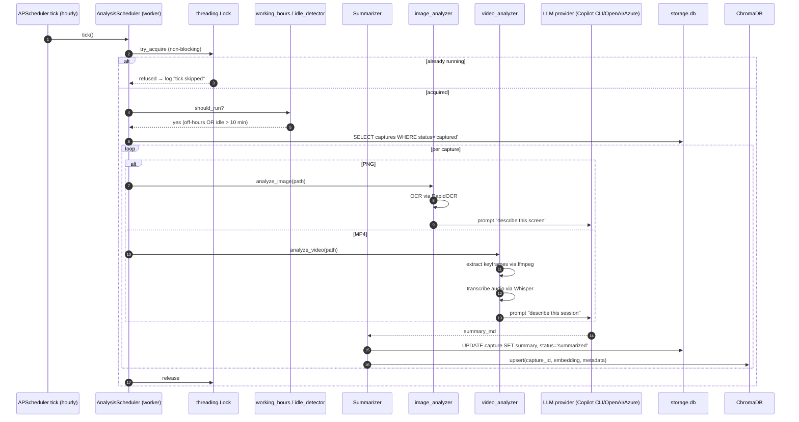
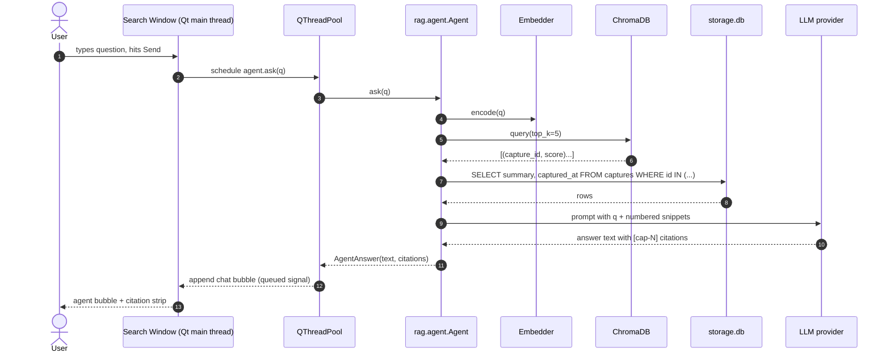

# RIN architecture

This document is the long-form complement to the [README's data-flow
section](../README.md#-for-ai-agents-working-on-this-codebase). If you
are an AI agent or a new contributor, read the README first; come here
when you need the detailed *why* and the sequence diagrams.

## 1. Component map

```
                ┌──────────────────────────────────────────────────────┐
                │                       Tray UI                        │
                │  (PySide6 QSystemTrayIcon + secondary windows)       │
                └─────┬────────────┬────────────┬────────────┬─────────┘
                      │            │            │            │
   user opens         │            │   user opens            │
   Settings           │            │   Reports / Search      │
                      ▼            ▼            ▼            ▼
            ┌──────────────┐  ┌──────────┐ ┌──────────┐ ┌──────────────┐
            │ Settings     │  │ Reports  │ │ Search   │ │ Diagnostics  │
            │ Dialog       │  │ Window   │ │ Window   │ │ (Help menu)  │
            └──────┬───────┘  └────┬─────┘ └────┬─────┘ └──────┬───────┘
                   │               │            │              │
                   ▼               ▼            ▼              ▼
            ┌──────────────────────────────────────────────────────────┐
            │                 RinConfig (TOML)                         │
            │   + utils.diagnostics + ui.theme + ui.style              │
            └──────────────────────────────────────────────────────────┘

  Background threads (start once at app boot, stop on Quit):

      ┌──────────────┐  ┌──────────────┐  ┌──────────────┐  ┌──────────────┐
      │ InputManager │  │ AnalysisSch. │  │ ReportsSch.  │  │ BucketSch.   │
      │  (pynput /   │  │ (APScheduler)│  │ (APScheduler)│  │ (APScheduler)│
      │   hidapi)    │  │              │  │              │  │              │
      └──────┬───────┘  └──────┬───────┘  └──────┬───────┘  └──────┬───────┘
             │                 │                 │                 │
             ▼                 ▼                 ▼                 ▼
      ┌──────────────┐  ┌──────────────┐  ┌──────────────┐  ┌──────────────┐
      │ CaptureSvc   │  │ Summarizer + │  │ ReportGen.   │  │ BucketArch.  │
      │  (mss +      │  │ video/image  │  │  (Jinja2 +   │  │ (skills/*    │
      │   ffmpeg)    │  │ analyzer     │  │   md)        │  │  bucket.py)  │
      └──────┬───────┘  └──────┬───────┘  └──────┬───────┘  └──────┬───────┘
             │                 │                 │                 │
             ▼                 ▼                 ▼                 ▼
      ┌─────────────────────────────────────────────────────────────────┐
      │     storage  (SQLite via SQLAlchemy + ChromaDB + filesystem)    │
      └─────────────────────────────────────────────────────────────────┘
```

## 2. Process model

RIN is a single OS process (`python -m rin`) that runs:

- **The Qt main thread** — owns every widget. Cannot block: any work
  longer than a paint frame must be offloaded to a worker.
- **A global `QThreadPool`** — for capture I/O (`take_screenshot`,
  `start_recording`, `stop_recording`). These are short-lived tasks
  scheduled per click.
- **Three APScheduler `BackgroundScheduler` instances** — one for
  analysis (`AnalysisScheduler`), one for reports (`ReportsScheduler`),
  one for bucket archival (`BucketScheduler`, every 6 h by default).
  All three run their ticks behind a `threading.Lock` so overlapping
  ticks no-op.
- **Listener threads inside pynput + hidapi** — these post `InputEvent`
  values back to the manager via a queued Qt signal so the gesture
  recogniser runs on the Qt main thread.

> **Rule**: any callback that originates on a non-Qt thread (APScheduler,
> ThreadPool, pynput) **must** marshal through a `Signal(...,
> Qt.QueuedConnection)` before touching a `QWidget`. R3 in the v0.3.1
> review log existed because we briefly forgot this.

## 3. Sequence diagrams

### 3.1 Tap → captured row

```mermaid
sequenceDiagram
    autonumber
    actor User
    participant Listener as pynput/hidapi listener (worker thread)
    participant Mgr as InputManager (Qt main thread)
    participant Gest as GestureRecognizer
    participant Tray as TrayApp
    participant Pool as QThreadPool
    participant Cap as CaptureService
    participant DB as storage.db (SQLite)
    participant FS as captures/ (PNG)

    User->>Listener: press trigger key
    Listener->>Mgr: emit InputEvent (queued)
    Mgr->>Gest: handle_event(press)
    Note over Gest: 500 ms hold-threshold timer<br/>arms; release within<br/>that window = tap
    User->>Listener: release trigger key
    Listener->>Mgr: emit InputEvent (queued)
    Mgr->>Gest: handle_event(release)
    Gest-->>Mgr: shot_requested
    Mgr-->>Tray: shot_requested
    Tray->>Pool: schedule take_screenshot
    Pool->>Cap: take_screenshot()
    Cap->>FS: mss.shot() write PNG(s)
    Cap->>DB: INSERT capture (status='captured')
    Cap-->>Tray: capture_id
    Tray-->>User: tray toast "Screenshot saved"
```

If the user instead **holds** past `hold_threshold_ms` the recogniser
emits `record_started`, the tray spawns ffmpeg via `Recorder.start()`,
and a release event later emits `record_stopped` which calls
`stop_recording()` (gracefully sends `q` to ffmpeg stdin, falls back to
SIGTERM).

### 3.2 Analysis tick → summary → vector



The `Gate` step is what lets the analyser run only outside the user's
working hours (default Mon-Fri 09:00-18:00) or after the system has
been idle for ≥ 10 minutes. The *manual* "🧠 Analyze now" button
bypasses this gate by passing `force=True`.

### 3.3 User asks a question → RAG answer with citations



## 4. Data layout on disk

```
%LOCALAPPDATA%\RIN\
├─ config.toml              # RinConfig (TOML, never contains secrets)
├─ rin.db                   # SQLite (captures, summaries, reports, poi_candidates)
├─ .lock                    # Single-instance file lock (msvcrt/fcntl, auto-released on process death)
├─ .master.key.enc          # AES-256-GCM master key, DPAPI-wrapped per-user
├─ chroma/                  # ChromaDB persisted directory
├─ logs/
│   └─ rin.log              # loguru, rotated daily, 7 days kept
├─ models/                  # Sentence-transformer + Whisper caches (prefetched)
├─ skills/                  # User-installable skill plugins (e.g. <name>/skill.py)
├─ reports/
│   ├─ daily-YYYYMMDD.md    # Daily report markdown
│   ├─ weekly-YYYYMMDD.md   # Weekly report markdown
│   └─ archives/
│       └─ <skill>/<key>.md # Bucket archives (e.g. support_ticket/Case-2606050030000773.md)
└─ captures/
    └─ YYYY/MM/DD/
        └─ 20260528-093712-shot/   # or -rec for recordings
            ├─ monitor-1.png
            ├─ monitor-2.png
            └─ meta.json
```

Secrets (OpenAI / Azure API keys) live in **Windows Credential Manager**
via the `keyring` package — never in `config.toml`.

## 5. Why these choices

Most of the rationale is captured in the README's decision log. The
ones that need extra explanation:

- **Two scheduler threads, not one** — analysis and reports have very
  different latencies (minutes vs. seconds) and very different failure
  modes. Coupling them would mean a stuck analysis run blocks the
  daily report from going out.

- **ChromaDB *and* SQLite, not just ChromaDB** — ChromaDB is great for
  vector search but terrible for relational queries like "give me the
  20 most recent captures of any kind". We keep the canonical row in
  SQLite and mirror just enough metadata into the vector store for
  retrieval.

- **`InputEvent` as a frozen dataclass** — listeners run in arbitrary
  threads, and we route their output through a Qt queued signal. The
  Qt meta-object system requires the payload type to be hashable /
  copyable; frozen dataclasses are the cheapest way to satisfy that.

- **OCR before LLM** — Vision LLMs read text from screenshots but they
  hallucinate IDs and timestamps. Running OCR first lets us include
  the verbatim text in the prompt as ground truth, then ask the LLM to
  describe *meaning* on top of it.

## 6. When you change things

If you touch:

| Area | Also update |
|------|-------------|
| `config.RinConfig` fields | `Settings` page in `ui/settings_dialog.py` + a test |
| `analysis/*` pipeline | likely the `summarizer` orchestrator + a `tests/test_analysis_*` |
| `llm/*` provider | the factory in `llm/factory.py` + `tests/test_llm_factory.py` |
| `ui/theme.py` | run `tests/test_ui_theme.py` (WCAG AA) and capture new screenshots in `docs/screenshots/after/` |
| `recorder.py` ffmpeg flags | regenerate the smoke recording (5-second test) and confirm `recorder.stop()` exits cleanly |
| Any subprocess | confirm `encoding="utf-8", errors="replace"` is set |

See [CONTRIBUTING.md](../.github/CONTRIBUTING.md) for the rest of the bar.
